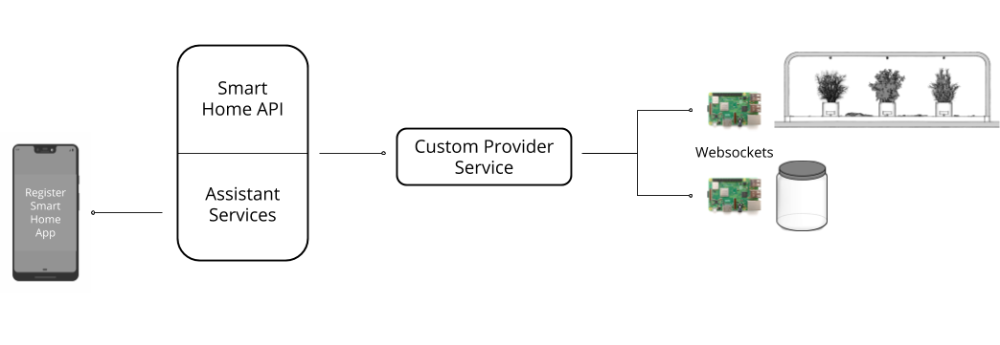

# Google Smart Home API: Planter and Cookie Jar

Disclaimer: THESE INSTRUCTIONS ARE BEING PROVIDED FOR INFORMATIONAL PURPOSES ONLY AND ARE NOT INTENDED TO BE USED FOR THE PRODUCTION OF COMMERCIAL PRODUCTS. BY EXECUTING THESE INSTRUCTIONS, YOU AGREE TO ASSUME ALL LIABILITY IN CONNECTION WITH YOUR BUILDING AND USE OF ANY DEVICE. DEEPLOCAL DISCLAIMS ALL WARRANTIES EXPRESS OR IMPLIED WITH RESPECT TO THESE INSTRUCTIONS AND ANY RESULTING DEVICE INCLUDING BUT NOT LIMITED TO WARRANTIES FOR MERCHANTABILITY, FITNESS FOR ANY PARTICULAR PURPOSE, AND NON-INFRINGEMENT. YOU SHOULD USE EXTREME CAUTION WHEN BUILDING AND USING ANY DEVICE PURSUANT TO THESE INSTRUCTIONS. IN NO EVENT SHALL DEEPLOCAL BE LIABLE FOR ANY CLAIM OR DAMAGES, INCLUDING BUT NOT LIMITED TO CLAIMS OR DAMAGES RELATED TO DEATH OR PERSONAL INJURY, PROPERTY DAMAGE, OR PRODUCT LIABILITY.

## Tools

- Soldering iron and solder
- Wire strippers
- Drill and step
- PVC tube cutter
- Screwdriver set
- Set of standard wrenches
- Allen key sets - standard and metric
- 10-24 and 10-32 taps and tap handle

## Materials

| Part                                                                                                                                                                                                                 | Qty | Total    |
| -------------------------------------------------------------------------------------------------------------------------------------------------------------------------------------------------------------------- | --- | -------- |
| [Brass Misting Nozzles, 10-24 thread, 10 pack](https://www.ebay.com/itm/371916188602)                                                                                                                                | 1   | \$8.99   |
| [Hose, 1/2" ID 3/4" OD, 5 ft](https://www.mcmaster.com/5633k24)                                                                                                                                                      | 1   | \$15.80  |
| [Thru-Wall Pipe fitting, 1/4" NPT Female](https://www.mcmaster.com/3773k116)                                                                                                                                         | 1   | \$33.62  |
| [Hose Clamp for 3/4" OD hose](https://www.mcmaster.com/5388k17)                                                                                                                                                      | 2   | \$6.87   |
| [Barb for 1/2" hose, 1/4" NPTM, pack of 5](https://www.mcmaster.com/5346k22)                                                                                                                                         | 1   | \$9.97   |
| [Barb for 1/2" hose, 1/4" NPTF, pack of 5](https://www.mcmaster.com/5346k37)                                                                                                                                         | 1   | \$12.10  |
| [1/4" NPT Female T](https://www.mcmaster.com/50785k72)                                                                                                                                                               | 2   | \$12.00  |
| [1/4" NPT Female Elbow](https://www.mcmaster.com/50785k36)                                                                                                                                                           | 3   | \$12.12  |
| [1/4" OD tube, 10-32 male thread](https://www.mcmaster.com/7880t189)                                                                                                                                                 | 3   | \$8.88   |
| [Electric Solenoid Valve](https://www.mcmaster.com/5489t411)                                                                                                                                                         | 3   | \$227.58 |
| [1/4" shaft coupling](https://www.mcmaster.com/59985k1)                                                                                                                                                              | 3   | \$31.62  |
| [5mm shaft coupling](https://www.mcmaster.com/59985k1)                                                                                                                                                               | 3   | \$31.62  |
| [Acetal coupling disc](https://www.mcmaster.com/59985k61)                                                                                                                                                            | 3   | \$6.96   |
| [Flanged 0.25 shaft collar](https://www.mcmaster.com/9684t27)                                                                                                                                                        | 3   | \$130.32 |
| [0.25" thrust washer](https://www.mcmaster.com/5906k561)                                                                                                                                                             | 3   | \$1.26   |
| [0.25" shaft dia ball bearing, SS](https://www.mcmaster.com/6138k65)                                                                                                                                                 | 3   | \$22.77  |
| [0.25 D shaft, 6 in length](https://www.mcmaster.com/8632t132)                                                                                                                                                       | 1   | \$6.79   |
| [Aluminum Rod, 0.75" dia, 6 in length](https://www.mcmaster.com/8974K299)                                                                                                                                            | 1   | \$2.89   |
| [SS standoff (custom threads), 1/4" OD](https://www.mcmaster.com/92320a099)                                                                                                                                          | 9   | \$69.12  |
| [OS Washer, 1" OD, for #8 screw](https://www.mcmaster.com/91525a268)                                                                                                                                                 | 3   | \$4.60   |
| [8-32 Male Female hex standoff, 1.25" length](https://www.mcmaster.com/93620a457)                                                                                                                                    | 12  | \$19.92  |
| [Cable Holder for 1/4" hose](https://www.mcmaster.com/2024n102)                                                                                                                                                      | 1   | \$3.07   |
| [Raspberry Pi 3](https://www.amazon.com/gp/product/B01C6EQNNK/)                                                                                                                                                      | 1   | \$50.00  |
| [6in dia pot](https://www.amazon.com/gp/product/B07BKYLZWJ/ref=ppx_od_dt_b_asin_title_s00?ie=UTF8&psc=1)                                                                                                             | 3   | \$80.70  |
| [Water Pump (160 psi)](https://www.amazon.com/gp/product/B071Z75WYM/)                                                                                                                                                | 1   | \$68.00  |
| [Teflon Tape](https://www.amazon.com/gp/product/B00ITPHXZI/)                                                                                                                                                         | 1   | \$3.95   |
| [Push to Connect Fitting (1/4" OD tube, 1/4" NPT thread)](https://www.amazon.com/gp/product/B00AXAY47W/)                                                                                                             | 6   | \$16.49  |
| [1/4"OD tubing](https://www.amazon.com/gp/product/B071D9G3YP/)                                                                                                                                                       | 1   | \$9.99   |
| [Manual shut off valve](https://www.amazon.com/gp/product/B012DIW9YG/)                                                                                                                                               | 3   | \$6.99   |
| [Decorative rocks](https://www.amazon.com/Rainforest-Black-Grade-Polished-Pebbles/dp/B06XTBRP54/ref=sr_1_fkmr0_1?keywords=.5+grey+rainforest+pebbles&qid=1553718196&s=gateway&sr=8-1-fkmr0#customerReviews)          | 3   | \$69.00  |
| [24 V Power Supply, DIN rail](https://www.amazon.com/gp/product/B005T6OBFU/ref=ox_sc_act_title_1?smid=ATVPDKIKX0DER&psc=1)                                                                                           | 1   | \$17.90  |
| [12V Power Supply, DIN rail](https://www.amazon.com/gp/product/B00MEKLTKY/ref=ox_sc_act_title_2?smid=A32M554Q36OZE3&psc=1)                                                                                           | 2   | \$51.00  |
| [5V Power Supply, DIN rail](https://www.amazon.com/gp/product/B005T6RBSO/ref=ox_sc_act_title_1?smid=ATVPDKIKX0DER&psc=1)                                                                                             | 2   | \$27.02  |
| [16 AWG wire](https://www.amazon.com/gp/product/B0746HRVZP/)                                                                                                                                                         | 1   | \$8.80   |
| [22 AWG wire](https://www.amazon.com/gp/product/B00B4ZQ3L0/)                                                                                                                                                         | 1   | \$16.50  |
| [26 AWG wire](https://www.amazon.com/Stranded-Felexible-Insulated-Electronic-ELectrical/dp/B07J3DS831/ref=sr_1_4?keywords=26+gauge+wire&qid=1553630563&s=gateway&sr=8-4)                                             | 1   | \$13.99  |
| [Power Strip](https://www.amazon.com/Over-Load-Control-iClever-Protector-Extension/dp/B06XH1PKRJ/ref=sr_1_fkmrnull_3_sspa?keywords=fused+power+strip+anker&qid=1553633301&s=electronics&sr=1-3-fkmrnull-spons&psc=1) | 1   | \$25.00  |
| [Humidifier](https://www.amazon.com/dp/B01JYJT1E8/ref=pe_2640190_232748420_TE_item)                                                                                                                                  | 2   | \$64.00  |
| [Water Filter](https://www.amazon.com/gp/product/B01M68KRIK/)                                                                                                                                                        | 1   | \$19.99  |
| [Flexible Nozzle](https://www.amazon.com/Orbit-Arizona-Outdoor-Extension-10056H/dp/B0013I96VC/ref=sr_1_12?keywords=misting+nozzle&qid=1553010061&s=gateway&sr=8-12)                                                  | 1   | \$9.91   |
| [1 gal container(s)](https://www.amazon.com/1790-Gallon-Cereal-Container-Built/dp/B07F7JRSYD/ref=sr_1_2_sspa?keywords=container+airtight+1+gallon&qid=1553883209&s=gateway&sr=8-2-spons&psc=1)                       | 1   | \$19.99  |
| [CNC Shield](https://www.amazon.com/HiLetgo%C2%AE-Engraver-Printer-Expansion-Arduino/dp/B01D2HL9T8/ref=sr_1_2_sspa?keywords=cnc+shield&qid=1557152771&s=gateway&sr=8-2-spons&psc=1)                                  | 1   | \$6.79   |
| [Black Light UV 5050 LED Strip Light](https://www.environmentallights.com/15000-uv400-cc5050-60-reel.html)                                                                                                           | 1   | \$149.30 |
| [Light Strip Channel](https://www.environmentallights.com/18541-led-strip-light-bar-12-2m.html)                                                                                                                      | 1   | \$51.85  |
| [Channel Cap](https://www.environmentallights.com/14576-led-strip-light-bar-end-12.html)                                                                                                                             | 10  | \$7.50   |
| [Channel Cap with hole](https://www.environmentallights.com/14577-led-strip-light-bar-end-wire-12.html)                                                                                                              | 6   | \$4.50   |
| [Waterproof Glue](https://www.environmentallights.com/12209-waterproof-ribbon-glue.html)                                                                                                                             | 2   | \$2.50   |
| [Mounting Clip](https://www.environmentallights.com/14578-led-strip-light-bar-clip-12.html)                                                                                                                          | 8   | \$4.00   |
| [Beefcake Relay Kit](https://www.sparkfun.com/products/13815)                                                                                                                                                        | 4   | \$35.80  |
| [Arduino Uno](https://www.sparkfun.com/products/11021)                                                                                                                                                               | 1   | \$22.95  |
| [USB Cable A to B](https://www.sparkfun.com/products/512)                                                                                                                                                            | 1   | \$3.95   |
| [Mosfet Power Control Kit](https://www.sparkfun.com/products/12959)                                                                                                                                                  | 1   | \$4.95   |
| [Silent Step Stick](https://www.digikey.com/product-detail/en/trinamic-motion-control-gmbh/TMC-SILENTSTEPSTICK/1460-1159-ND/5724190)                                                                                 | 5   | \$39.90  |
| [Stepper motors](https://www.pololu.com/product/1205)                                                                                                                                                                | 6   | \$95.70  |
| [3/4" OD 0.25" thick 16.39 lbf magnet](https://www.kjmagnetics.com/proddetail.asp?prod=RC24DCS)                                                                                                                      | 4   | \$13.60  |

## Warnings

- This project involves high-voltage wiring (mains 110V). Take appropriate safety precautions when working with mains voltage, and ensure that everything is unplugged before touching electrical connections.
- This project also involves moderately pressurized water. Use appropriate sealing strategies on all joints, and always leak-test before installing.
- Most importantly, water and electricity can be dangerous in combination. Plan your electrical layout to eliminate any possibility of leaking water coming in contact with electrical connections. We suggest a basic layout strategy in the instructions, but use care and common sense to keep yourself safe.

## Planter Assembly Steps

### Pump system


1. Start by drilling a 1-1/16” hole in a plastic reservoir using a step bit.
   

2. Slide the thru-fitting into the hole and tighten down the fitting nut.
   

3. Thread a ¼” NPT male barb into the fitting using plumbers tape to ensure a watertight seal.
   

4. Cut a section of ¾” OD, ½” ID tubing using a PVC pipe cutter and connect the barb on the reservoir to the inlet side of the pump.
   
   

5. Cut another section of hose and attach it to the outlet side of the pump. Slide a ¼” NPT female barb into the other side of the hose.
   

6. The outlet side of the pump is pressurized, so be sure to secure the hose on the barbs with hose clamps.
   

7. Thread a push-to-connect fitting into the tube barb, once again using plumber’s tape on the threads.
   

8. Cut a short length of ¼” OD tubing using the PVC cutter and press it firmly into the push-to-connect fitting.
   
   

9. Attach a manual valve to the tube.
   

10. Cut another short length of tubing and connect it to the inlet side of the filter. Using a filter will prevent sediment from clogging the mist nozzles.
    

11. Attach another short length of tubing to the outlet of the filter.
    

12. Secure an electric solenoid valve on the outlet side of the filter. The inlet of the solenoid is labeled with a “2”.
    

13. Add tubing to the outlet of the solenoid valve and attach the 90 degree push-to-connect fitting to the end. We used a stainless steel standoff with 10-24 tapped threads on one side and 10-32 threads on the other to connect the mist nozzle to the 90 degree fitting.
    
    
    

#### Priming the pump

1. Fill the water reservoir.

2. Temporarily remove the tubing that enters the solenoid valve and place this end into a bucket to collect water during the priming process.

3. Open the manual shut-off valve.

4. Plug in the water pump. Water will gush out into the bucket in an uneven stream with bubbles.

5. Wait for the bubbles to turn into a continuous, solid stream of water. This should only take a few seconds.

6. Once the stream looks good, close the manual shut-off valve.
   With the manual shut-off valve closed, the pump should pressurize and turn off within a few seconds. If the pump does not turn off, check for air or water leaks at the intake or outlet connections.

7. Now that the system is primed and stable, it is a good time to check for leaks. Dry off any spilled water, and then wait for a few minutes. If any water appears, check the nearest seal.

8. Re-attach the tubing to the electric valve. Open the manual shut-off valve and check for leaks again.

9. At this point, the pump is primed. We recommend leak-testing the downstream seals and the mister nozzles. To do so, close the manual shut-off valve, bypass the electric valve, and re-open the manual shut-off valve to supply pressure to the downstream system.

10. Seal any leaks and test again.

#### Rotating Pedestal


1. Attach the hex standoffs to the underside of the planter, threading into 8-32 wood inserts.
   

2. Bolt the stepper to the acrylic mounting plate with four M2.5 x 8mm bolts. Also attach the 5mm bore side of the shaft coupling to the stepper shaft.
   

3. Attach the other side of the coupling to the 0.25” diameter shaft and slide the shaft through the bearing.
   

4. Attach the acrylic plate and stepper motor to the standoffs.
   

5. Slide an oil-embedded thrust washer onto the top side of the shaft.
   

6. Add an acrylic ring to prevent water and debris from contaminating the bearing. This should be glued in with silicone or waterproof caulking.
   

7. Slide the shaft collar over the shaft and tighten the collar bolts.
   
   
8. Attach the 3D printed pedestal on top of the shaft collar.
   
   
9. Next attach the magnet to the bottom of the 6in pot.
   
   
10. Insert the acrylic nut into the pot and attach the magnet to the bottom.
    
    

11. The pot should now snap into place on the pedestal via the magnet.
    

#### Lights

For lights, we used 24V white LEDs with a MOSFET Power Control kit to control brightness. However, we recommend using [100W grow bulbs](https://www.homedepot.com/p/Newhouse-Lighting-100W-Equivalent-PAR38-Red-Blue-LED-Grow-Light-Bulb-PAR38GROW/301342271) that emit UV light for best plant results.


#### Humidifier system

To set humidity levels, we used an off-the-shelf humidifier that was controlled by a Beefcake relay.

1. Snip the plug from the humidifier and strip back roughly ¼” of wire housing.

   
   

2. Attach one wire to the AC neutral. The other wire attaches to the normally open pin on the relay, as shown in the wiring diagram below.
   

#### Wiring Diagram


## Smart Home Programming Overview: How do we control a smart herb garden and cookie jar using Assistant Services and the Home Graph API?

- A user adds our custom Smart Home app to their list of Home Control apps in the Google Home app.
- The user makes a request to a Google Assistant-powered device like “Start watering the Basil".
- The Home Graph API notifies the Provider Service that a request has been made to start the process in the “Basil” zone.
- The Provider Service finds the user’s garden device (running on a Raspberry Pi) and sends an appropriate websocket request.
- The Raspberry Pi running the Garden receives the message and sets the correct GPIO pins to trigger the relays that run the watering valves.
  

### Step 1: Create an Actions on Google Developer Project

1. In the [Actions Console](https://console.actions.google.com/u/0/), click Add/Import project
2. Enter a name for the project and click Create Project
3. Choose Home Control as your project type
4. Choose Smart Home as the control experience
5. Save the project ID in the dashboard for later use
6. On the left hand side under SETUP, click Invocation
7. Add your app's name. Click Save.
8. On the left navigation menu under DEPLOY, click on Directory Information
9. Add your app info and click Save

### Step 2: Generate a service-account.json file

1. From your actions project dashboard, click the settings cog and select _Permissions_
2. In the left hand menu, select _Service Accounts_ and _+Create Service Account_
3. Give the account a name, a Role of _Owner_ and have it _Furnish a new private key_
4. Click _Save_ and copy the service-account.json file into the provider_server directory of the project

### Step 3: Tell Google where it should forward provider requests (SYNC, QUERY, EXEC)

1. Navigate to the [Google Cloud Console API Manager](https://console.developers.google.com/apis)
2. Enable the [Home Graph API](https://console.cloud.google.com/apis/api/homegraph.googleapis.com/overview)
3. On your project dashboard, navigate to Credentials
4. Copy the 'Key' column value for the 'Api Key' entry
5. Paste that key into the cloud/config-provider.js as the 'Config.smartHomeProviderApiKey' value
6. In cloud/config-provider.js, replace the existing values for 'smartHomeProviderGoogleClientId' and 'smartHomeProvideGoogleClientSecret' with your own unique values
7. On your project dashboard, under Build --> Actions, click on the actions.devices action and enter your fulfillment url. This will be {the endpoint where you're hosting the project}/smarthome (e.g. https://smarthome-exampleproject.appspot.com/smarthome).
8. Under Advanced Options --> Account Linking, select Oauth/Authorization Code as the linking type and enter your client information (i.e. the values you entered for 'smartHomeProviderGoogleClientId' and 'smartHomeProvideGoogleClientSecret')
9. Click Save
10. Navigate to 'Actions' and click 'Test'

### Step 4: Run the server on a public domain

1. If you are using Google App Engine, simply run 'gcloud app deploy' under the correct gcloud project

2. If you are using a server hosted elsewhere, install dependencies and start by running:

```
npm install
npm start
```

### Step 5: Link your devices by responding to a SYNC request

1. Make sure you're using a device logged in under the same account as the Google Developer Project
2. In the Google Home app, in the menu, click Home Control
3. Click the (+) button and add your [test] app
4. The provider server should receive a SYNC request and respond with all of the devices in the cloud/devices.js file

### Step 6: Configure the garden and cookie jar to point at your provider server

1. Install an SD card with a Raspian-stretch lite image and clone the smart-home project in the pi user's home directory
2. Substitute your provider server endpoint for the value PROVIDER_ENDPOINT in garden/app.js and garden/cookie.js
3. Change directories to the garden with

```
cd garden
```

4. Install the relevant dependencies with

```
npm install
```

5. To start the Garden app run

```
sudo node app.js
```

6. To start the Cookie app run

```
sudo node cookie.js
```

### Step 7: Run a test

1. In the actions console simulator or any Assistant powered device, run the query "Start watering the basil"
2. The provider server should get an EXEC request for action.devices.traits.StartStop and the relay should activate and turn on the sprinkler
